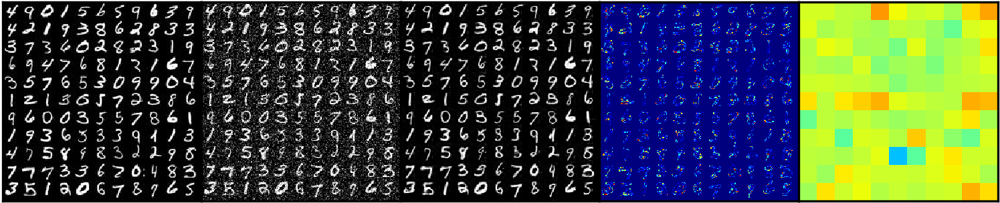

# Pytorch Implementation of AVID

AVID: Adversarial Visual Irregularity Detection [[paper]](https://arxiv.org/abs/1805.09521)

## Environments
* python 3.6
* pytorch 0.4.1

## Results
I could not reproduce the results of the paper ...
 

original, added noise, inpainted, diff and discriminated are arranged from left.